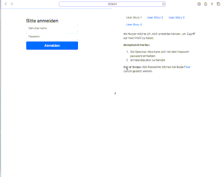

# Testobjekt für die Testautomatisierung

## Inhaltsverzeichis

- [Testobjekt für die Testautomatisierung](#testobjekt-für-die-testautomatisierung)
  - [Inhaltsverzeichis](#inhaltsverzeichis)
  - [Übersicht](#übersicht)
  - [Was ist das Testobjekt](#was-ist-das-testobjekt)
    - [Einsatzbereich und Zielgruppe](#einsatzbereich-und-zielgruppe)
    - [Ungeeignete Anwendungsbereiche](#ungeeignete-anwendungsbereiche)
    - [Welche Versionen gibt es](#welche-versionen-gibt-es)
    - [Besonderheiten des Testobjekts](#besonderheiten-des-testobjekts)
      - [Programmiersprachen und Frameworks](#programmiersprachen-und-frameworks)
    - [Datenbanken](#datenbanken)
      - [Wie kommen User Stories udn Nutzer in das Testobjekt](#wie-kommen-user-stories-udn-nutzer-in-das-testobjekt)
  - [Anleitung zur Nutzung](#anleitung-zur-nutzung)
  - [Hinweise zur Weiterentwicklung](#hinweise-zur-weiterentwicklung)
  - [Support und Kontakt](#support-und-kontakt)

## Übersicht

Das Testobjekt wird entwickelt, um eine praxisnahe Testumgebung für die Automatisierung von Softwaretests bereitzustellen. Es ermöglicht insbesondere Studierenden und Entwicklern, ihre Kenntnisse im Bereich der Testautomatisierung zu vertiefen und anzuwenden.

## Was ist das Testobjekt

### Einsatzbereich und Zielgruppe

Das Testobjekt ist ein Tool zur Unterstützung der Ausbildung und Praxis im Bereich der Testautomatisierung. Es bietet eine lokale, isolierte Umgebung, in der Nutzer ihre Testautomatisierungsfähigkeiten entwickeln und testen können.

### Ungeeignete Anwendungsbereiche

Dieses Repository enthält lediglich einen Entwicklungsstand zu Übungszwecken und sollte unter keinen Umständen in einer Produktivumgebung eingesetzt werden.
Dieses Webentwicklungsprojekt wurde ausschließlich zu Lern- und Testzwecken erstellt und wird in einem öffentlichen Repository gehostet. Der bereitgestelten Codes sollte in seiner hier bereitgestellten Form **nicht** in einer Produktivumgebung eingesetzt werden. Es wird keine Garantie für die Funktionsfähigkeit oder Sicherheit der Anwendung übernommen. Der Code steht unter der MIT-Lizenz und kann frei verwendet und modifiziert werden, solange die Urheberrechte beachtet werden. Für Schäden, die durch die Nutzung oder Fehlfunktion der Anwendung entstehen, wird keine Haftung übernommen. Fragen oder Anmerkungen zu diesem Projekt können über das Projektteam *ProPra* mitgeteilt werden.

### Welche Versionen gibt es

Es werden 3 Versionen des Testobjekt umgesetzt, die aus Übungszwecken Auswirkunegna auf die zu entwickelden Testfälle haben werden.

- Version 1.0.0: Eine einfache Web-Lösung.
- Version 1.1.0: Erweiterte Funktionalitäten und Bugfixes.
- Version 3.0.0: Umfassende Änderungen in der Architektur und Entwicklungsstrategie.

### Besonderheiten des Testobjekts

Eine Besonderheit des Testobjekts ist die Integration von User Stories, die eine unmittelbare Darstellung der Entwicklungsanforderungen ermöglicht. Dies erleichtert die Arbeit ohne ein separates Ticket-Management-Tool und bietet den Vorteil, Anforderungen direkt im Kontext des Testobjekts zu sehen. Dieser Teil der Entwicklung wird als systemrelevant betrachtet und kann bei Bedarf ausgeblendet werden.

Auf der anderen Seite bietet das Testobjekt speziell für Lern- und Übungszwecke konzipierte Funktionen. Übungsaufgaben beziehen sich auf diesen Anwendungsbereich.

#### Programmiersprachen und Frameworks

Um den Lerninhalt des Programmierpraktikums (ProPra) effektiv zu unterstützen, wird das Testobjekt unter Verwendung von Python in der aktuellsten Version entwickelt. Durch den Einsatz des Python-Webframeworks Flask erstellen wir eine Web-Applikation, die speziell auf die im ProPra definierten Aufgaben und Anforderungen abgestimmt ist.

Die Anwendung nutzt zudem eine Kombination aus HTML und CSS, um eine benutzerfreundliche und visuell ansprechende Oberfläche zu gestalten. Durch den Einsatz von HTML erreichen wir eine strukturierte und semantisch korrekte Darstellung der Inhalte, während CSS für die stilistische Gestaltung und das Responsive Design der Anwendung sorgt.

Darüber hinaus verwenden wir Bootstrap, ein weit verbreitetes Front-End-Framework, um eine konsistente und responsive Benutzeroberfläche zu schaffen. Bootstrap bietet eine Vielzahl von vorgefertigten Komponenten und Layout-Optionen, die es uns ermöglichen, das Design effizient und effektiv umzusetzen, ohne von Grund auf neu beginnen zu müssen.

Ebenfalls integrieren wir kleine, aber entscheidende Teile in JavaScript, um interaktive Elemente in der Web-Applikation zu ermöglichen. Diese Integration von JavaScript ermöglicht es uns, eine dynamischere Benutzererfahrung zu schaffen, indem wir clientseitige Skripte verwenden, die auf Benutzeraktionen reagieren und ohne eine vollständige Neuladung der Seite Updates vornehmen können.

Die Kombination dieser Technologien - Python, Flask, HTML, CSS, Bootstrap und JavaScript - ermöglicht es uns, eine robuste, funktionale und benutzerfreundliche Testumgebung zu schaffen, die sowohl die Lernziele des ProPra-Programms unterstützt als auch den Anwender eine ansprechende Erfahrung bietet.

### Datenbanken

Für die Verwaltung der Testdaten setzen wir auf die Verwendung von SQL in Verbindung mit der SQL-Alchemie-Datenbank. Diese Kombination ermöglicht es uns, Daten effizient zu speichern, abzurufen und zu verwalten. Bei jedem Start der Anwendung wird automatisch überprüft, ob die erforderlichen Testdaten vorhanden sind.

Sollten die Testdaten fehlen – beispielsweise weil sie durch Testskripte gelöscht wurden – werden sie automatisch neu in die Datenbank eingespielt. Dieser Prozess gewährleistet, dass die Anwendung stets mit den notwendigen Daten versorgt ist und ermöglicht ein effizientes Testen ohne manuellen Eingriff.

Die Datenbankdateien werden im Verzeichnis instance/ gespeichert. Diese Strukturierung bietet den Vorteil, dass die Datenbankdateien bei Bedarf einfach und sicher gelöscht werden können, falls unerwartete Probleme auftreten sollten. Diese Flexibilität in der Datenbankhandhabung erleichtert die Wartung und Fehlerbehebung und macht die Anwendung robust gegenüber unvorhergesehenen Datenproblemen.

Durch diese Konfiguration stellen wir sicher, dass die Testumgebung jederzeit reproduzierbare und konsistente Ergebnisse liefert, was für die Zuverlässigkeit und Genauigkeit der Testautomatisierung von entscheidender Bedeutung ist.

#### Wie kommen User Stories udn Nutzer in das Testobjekt

Die Integration von User Stories und Nutzer in das Testobjekt erfolgt durch einen strukturierten und automatisierten Prozess. Zunächst werden die User Stories in einer JSON-Datei gespeichert, die sich im Verzeichnis 'data' befindet. Diese JSON-Datei dient als zentrale Quelle für die Testdaten und enthält alle notwendigen Informationen zu den User Stories oder Nutzern, wie etwa Beschreibungen, Akzeptanzkriterien und Nutzerdaten.

Bei der Initialisierung der Datenbank, die durch Flask gesteuert wird, wird diese JSON-Datei ausgelesen. Flask bietet hierfür passende Funktionen, um die Daten aus der JSON-Datei effizient zu extrahieren und zu verarbeiten. Nach dem Auslesen der Daten erfolgt eine Transformation, bei der die Daten in ein Format umgewandelt werden, das mit der Struktur der SQL-Alchemie-Datenbank kompatibel ist.

Anschließend werden die so aufbereiteten Daten in die Datenbank eingespielt. Dieser Vorgang findet typischerweise beim ersten Start der Anwendung statt oder kann bei Bedarf auch manuell ausgelöst werden. Durch diesen Mechanismus stellen wir sicher, dass die Datenbank stets mit den definierten Daten gefüllt ist, die dann im Rahmen der Testautomatisierung verwendet werden können.

Die Verwendung einer JSON-Datei als Quelle für die Daten bietet mehrere Vorteile: Sie ermöglicht eine einfache Handhabung und Bearbeitung der Testdaten und unterstützt die Transparenz sowie die Nachvollziehbarkeit der Daten. Zudem erleichtert diese Methode die Aktualisierung und Erweiterung der Daten, da lediglich die JSON-Datei angepasst werden muss, ohne die Notwendigkeit, direkt in die Datenbank einzugreifen.

## Anleitung zur Nutzung

TODO_Ruhe: Erläutern

## Hinweise zur Weiterentwicklung

TODO_Ruhe

## Support und Kontakt

TODO_Ruhe
